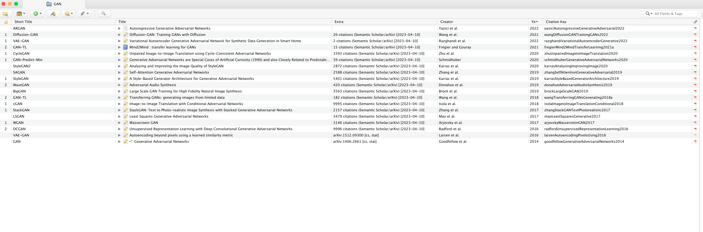
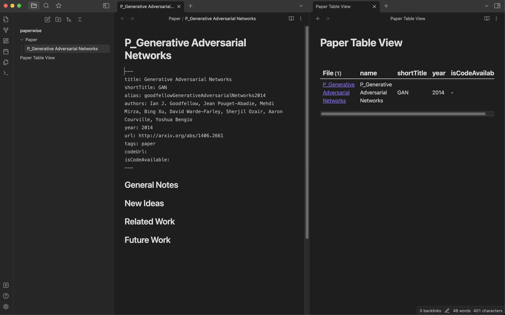

# Paperwise

This is a companion repository of the [Paperwise](http://walterteng.com/paperwise) article.

It is a starter template to get Paperwise workflow running.

## What is Paperwise?

Paperwise is a systematic and streamlined research workflow for managing AI papers that revolves around three core tools: [Zotero](https://www.zotero.org/), [ResearchRabbit](https://www.researchrabbit.ai/), and [Obsidian](https://obsidian.md/).

### Key Features

1. Seamless integration from paper discovery to paper management with Research Rabbit and Zotero
2. Overcome Zotero's 300MB free file size limit with cloud storage providers like Google Drive using [ZotFile](http://zotfile.com/)
3. Cross-platform sync of annotated PDFs across devices such as desktop, iOS devices and Android
4. Populate annotation and paper metadata automatically into Obsidian using [hans/obsidian-citation-plugin](https://github.com/hans/obsidian-citation-plugin) plugin.

## Overview

## Setup Guide

1. Follow the [article](http://walterteng.com/paperwise) to install required software such as Zotero and Obsidian.
2. Import `zotero/zotero.json` into Zotero. _`zotero.json` contains a sample of [Arxiv](https://arxiv.org/) papers about [Generative Adversarial Networks (GANs)](https://en.wikipedia.org/wiki/Generative_adversarial_network)_

_After importing zotero.json into Zotero_

3. Open Obsidian app and select the `paperwise-obsidian` folder and open it as a vault.
   1. This vault is pre-installed with [hans/obsidian-citation-plugin](https://github.com/hans/obsidian-citation-plugin) and [blacksmithgu/obsidian-dataview](https://github.com/blacksmithgu/obsidian-dataview).
   2. The Citation template and Data View template described in the article are populated as well.

_After opening Paperwise as Vault in Obsidian_

4.  Subsequently, you can create an account in [ResearchRabbit](https://www.researchrabbit.ai/) and link to your Zotero account.

_After importing your Zotero collection, you should be able to see similar recommendations._

Don't hesitate to reach out to me for any suggestions or feedback. Try this workflow today and experience the benefits for yourself!
